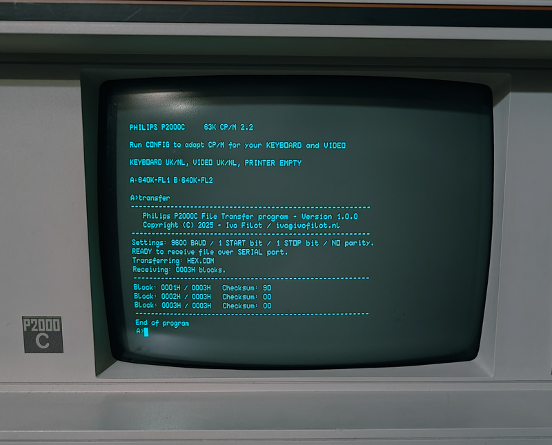
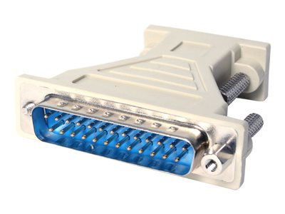
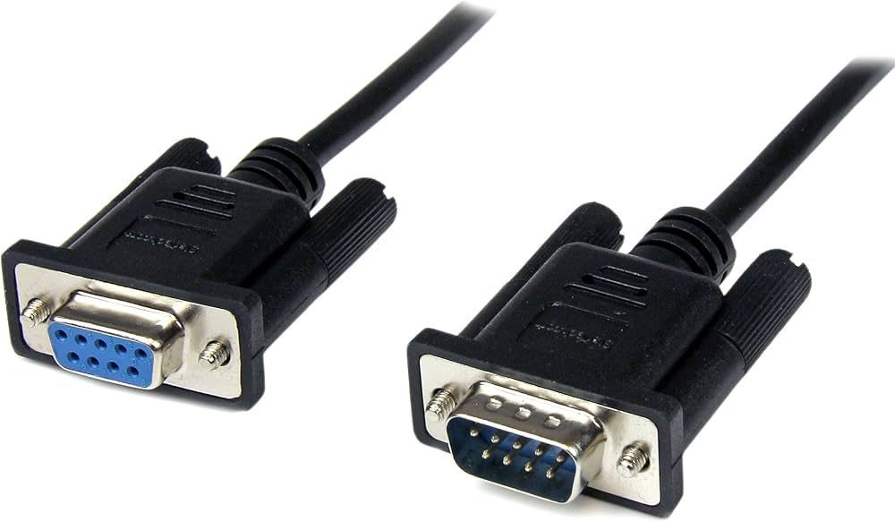
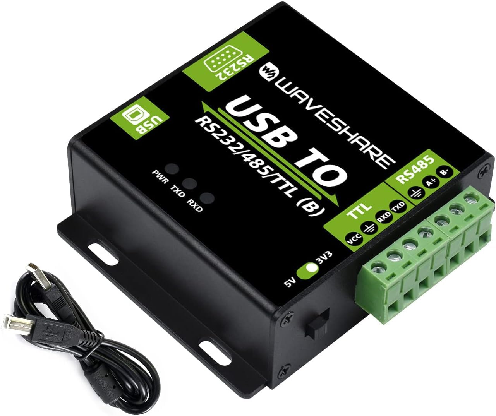

# Philips P2000C CP/M Transfer

Philips P2000C CP/M Transfer is a toolset for transferring files between a
modern computer and the Philips P2000C running CP/M 2.2. It enables seamless
file transfer via a serial connection using a custom protocol. This repository
includes the necessary software, setup instructions, a Python script to automate
transfers and some useful programs to test on your P2000C.



## Table of Contents

- [Philips P2000C CP/M Transfer](#philips-p2000c-cpm-transfer)
  - [Procedure](#procedure)
    - [Overview](#overview)
    - [Requirements](#requirements)
      - [Philips P2000C](#philips-p2000c)
      - [Hardware](#hardware)
    - [Serial communication settings](#serial-communication-settings)
    - [Getting TRANSFER.COM on the P2000C](#getting-transfercom-on-the-p2000c)
    - [Using TRANSFER.COM to copy KERMIT.COM over](#using-transfercom-to-copy-kermitcom-over)
  - [Useful information](#useful-information)
    - [How TRANSFER works](#how-transfer-works)
    - [Troubleshooting](#troubleshooting)
    - [Cross-compilation](#cross-compilation)
    - [Extracting Files from Philips P2000C Disk Images](#extracting-files-from-philips-p2000c-disk-images)
      - [Tools Required](#tools-required)
      - [Step-by-Step Instructions](#step-by-step-instructions)
    - [Archives](#archives)

## Procedure

### Overview

Below follows the basic procedure in a nutshell.

1. Send over the compile instructions (`TRANSFER.ASM`) for the `TRANSFER.COM`
   program
2. Assemble the `TRANSFER.COM` program.
3. Use `TRANSFER.COM` to transfer `KERMIT.COM`, a versatile and very robust file
   transfer program
4. Use `KERMIT.COM` from here on to transfer any other files.

### Requirements

#### Philips P2000C

To transfer files using the programs in this repository, you need to have
working Philips P2000C running CP/M 2.2 with the programs

* `PIP.COM`: To transfer text-based programs over serial
* `ASM.COM`: To compile assembly
* `LOAD.COM`: To create a `.COM` file

#### Hardware

For transferring files from your modern computer to the Philips P2000C, you need
the following (see also image)

1. A (male) DB25 to (female) DB9 adapter
2. A (male - female) DB9 null-modem cable 
3. A RS232 to USB adapter

<p align="center">
  
  
  
</p>

I have been using the Waveshare RS232/485/TTL to USB adapter with great success
(also in other projects), but admittedly, this option is on the more expensive
side and (significantly) cheapter alternatives exist.

### Serial communication settings

Unless otherwise specified, we assume throughout that the serial communication
proceeds using 9600 BAUD, one start bit, one stop bit and no parity
checking.

### Getting TRANSFER.COM on the P2000C

To use the `transfer` program on your Philips P2000C, we need to execute
the following steps

1. Copy over the source code
2. Compile it using `ASM.COM`
3. Create an executable using `LOAD.COM`
4. Run the resulting `TRANSFER.COM` program

First, we need to send over the assembly source code that contains the
transfer program. To do so, run the following on your P2000C

```
PIP TRANSFER.COM=RDR:
```

and run on your modern computer the script `sendasm.py`. Next, on your
P2000C, run the assembler to assemble the program

```
ASM TRANSFER
```

which should give an output similar to the following

```text
CP/M ASSEMBLER - VER 2.0
0498
003H USE FACTOR
END OF ASSEMBLY
```

After assembling, we need to create the `.COM` file using

```
LOAD TRANSFER
```

which should give an output akin to

```text
FIRST ADDRESS 0100
LAST  ADDRESS 0417
BYTES READ    0318
RECORDS WRITTEN 07
```

This should create the file `TRANSFER.COM`, which you can now execute by
typing

```
TRANSFER
```

### Using TRANSFER.COM to copy KERMIT.COM over

Assuming you have connected a RS232 to USB cable from your Philips P2000C to
your modern computer, you need to start the transfer program by running
`TRANSFER`. The Philips P2000C is put into a wait state. At this point, you can
transfer the `KERMIT.COM` from your modern computer to the P2000C, which will
automatically store the program on disk. Below, a Python code is
provided that fullfills this task.

> [!IMPORTANT]
> * You need to figure out to which (virtual) COM port your RS232 to USB adapter
>   is connected and modify this accordingly in the script below.
> * Do **not** change the timeout value **nor** the baud rate. It is critical
>   for the operation.
> * Any existing file with the same name will be **overwritten**.

```python
import serial
import time
import os
import struct

def main():    
    p = os.path.join('..', 'programs', 'utilities', 'KERMIT.COM')
    
    send_file_to_p2000c(p)

def send_file_to_p2000c(p):
    """
    Transfers a binary file over serial using a custom protocol.
    
    Steps:
    1. Opens the specified file in binary mode and reads its contents.
    2. Pads the file to a multiple of 128 bytes.
    3. Calculates the number of 128-byte blocks.
    4. Constructs a 14-byte header:
       - Start byte (0x01)
       - 8.3 UPPERCASE filename (11 bytes, space-padded)
       - 2-byte little-endian block count
    5. Opens a serial port (COM13 @ 9600 baud) for transmission.
    6. Sends the header and then the file in 128-byte chunks.
    7. After each chunk, waits for a 2-byte response:
       - First byte: checksum (should match calculated checksum)
       - Second byte: 0x06 (ACK) or other (NAC)
    8. Prints transfer progress with block index, checksum, response, and status.
    
    Raises:
    - AssertionError if header size is not 14 bytes or file size mismatch occurs.
    """
    with open(p, 'rb') as f:
        filedata = bytes(f.read())

    nrblocks = len(filedata) // 128 + (1 if len(filedata) % 128 != 0 else 0)
    filedata += bytes([0x00] * ((nrblocks * 128) - len(filedata)))
    
    # set header
    data = bytes([1])                                           # start byte
    data += bytes(convert_to_8_3_filename(p).encode('ascii'))   # filename
    data += bytes(struct.pack('<H', nrblocks))                  # number of blocks
    
    # check that header is 14 bytes
    assert len(data) == 14
        
    # check that filesize matches number of blocks
    assert len(filedata) == (nrblocks * 128)
    
    # Open COM13 at 9600 baud
    ser = serial.Serial(port='COM13', baudrate=9600, timeout=None)
    
    # Give the port some time to settle (optional, but helpful)
    time.sleep(0.2)
    
    # Send the data
    ser.write(data)
    time.sleep(1) # small delay
    
    # Write blocks
    for ctr,i in enumerate(range(0, len(filedata), 128)):
        chunk = filedata[i:i+128]
        ser.write(chunk)
        res = ser.read(2)   # read acknowledge byte
        checksum = sum(chunk)%256
    
        print('%03i / %03i: %02X / %02X / %s' % (
            ctr,
            nrblocks,
            checksum,
            res[0],
            'ACK' if res[1] == 0x06 else 'NAC',
        ))
    
    ser.close()

def convert_to_8_3_filename(path):
    """
    Given a path, extract the filename and convert that to CP/M 8+3
    format
    """
    
    base = os.path.basename(path)
    name, ext = os.path.splitext(base)
    
    name = name.upper()
    ext = ext.upper().lstrip('.')

    name_part = name[:8].ljust(8)
    ext_part = ext[:3].ljust(3)

    return name_part + ext_part

if __name__ == '__main__':
    main()
```

###

## Useful information

### How TRANSFER works

The TRANSFER program works by first waiting for a start byte `0x01`. If such
a start byte is received, the program continues, else it terminates. Upon
continuation, the P2000C needs to receive the metadata, which is composed of
a 8+3 filename followed by a 16 bit unsigned integer corresponding to the number
of 128 byte blocks. After receiving the metadata, the machine will consume a
number of 128 byte blocks. After each received block, the machine responds with
a CHECKSUM byte followed by a `0x06` acknowledge byte. The Python script will
capture the result received from the Philips P2000C, but will not raise any
errors when an invalid checksum is received. After all blocks are received,
the program will terminate.

> [!IMPORTANT]
> For a yet unknown reason, the act of transferring a file sometimes results
> in the P2000C stalling upon execution of any of the disk commands, e.g.
> when running `DIR`. If this happens, simply reset the machine.

### Troubleshooting

If for some reason the transfer does not work, the P2000C freezes or nothing
happens, simply unplug the RS232-USB cable on the modern computer side, restart
your P2000C and try again.

### Cross-compilation

> [!NOTE]
> If you are mainly interested in using the transfer program rather than
> (further) developing it, you can ignore this section.

To compile any of the test programs (under `samples`) or the transfer program
(under `src`), you need to have the [suite8080](https://github.com/pamoroso/suite8080)
package installed. This package is available via PyPi and can be installed
using the following instruction.

```bash 
pipx install suite8080
```

For testing a program in the CP/M environment, you can make use of
[z80pack](https://github.com/udo-munk/z80pack) which is available in this
repository as submodule. You can automatically download `z80pack` via

Make sure all subbmodules are loaded

```bash
git submodule init
git submodule update --recursive --remote
```

### Extracting Files from Philips P2000C Disk Images

This guide explains how to extract files from Philips P2000C `.td0` disk image
files using modern tools. These images can be converted and read with
`cpmtools`, once the correct disk format is defined.

### Tools Required

- `dsktrans` – to convert `.td0` (Teledisk) files to raw `.img` format
- `cpmtools` – to access CP/M file systems

### Step-by-Step Instructions

1. **Convert `.td0` to `.img` (raw image format):**

    ```bash
    dsktrans disk.td0 disk.img
    ```

2. **Create a disk definition for the P2000C in your `diskdefs` file:**

    Append the following entry to your `diskdefs` file (typically located at `/etc/cpmtools/diskdefs`):

    ```text
    # P2000C P2012 disk format
    # 5.25" disk DS/DD
    diskdef p2000c
      seclen 128
      tracks 80
      sectrk 32
      blocksize 4096
      maxdir 128
      boottrk 2
      skewtab 0 1 4 5 8 9 12 13 16 17 20 21 24 25 28 29 2 3 6 7 10 11 14 15 18 19 22 23 26 27 30 31
      os 2.2
    end
    ```

3. **List files on the disk:**

    ```bash
    cpmls -f p2000c disk.img
    ```

4. **Extract files from the disk:**

    ```bash
    cpmcp -f p2000c disk.img 0:MYFILE.COM .
    ```

#### Notes

- The `p2000c` disk format is not supported natively by `cpmtools`. Adding the
  entry above enables support.
- The `skewtab` is critical for correct sector ordering due to the interleaved
  format used by the P2000C BIOS.
- Files will extract in correct 4 KB blocks, matching CP/M allocation behavior
  on this system.

With this setup, you can browse and extract data from historic Philips P2000C
disk images reliably.

### Archives

During my search for Philips P2000C compatible files, I encountered the
following archives. Part of the contents of these archives might overlap.

* https://electrickery.nl/comp/p2000c/floppyImages/
* https://archive.org/download/UnRenamedFiles-Various/Philips%20P2000C%20files%20%5BTD0%5D.zip
* https://archive.org/download/UnRenamedFiles-Various/Philips%20P2000C%20files%20%5BIMD%5D.zip
* https://archive.org/download/UnRenamedFiles-Various/Philips%20P2000C%20files%20%5BCAS%5D.zip
* http://dunfield.classiccmp.org//img42841/d/p2000.zip
* https://web.archive.org/web/20210610183028/https://fjkraan.home.xs4all.nl/comp/p2000c/floppyImages/ (overlaps with electrickery.nl)
* https://retrocomputerverzamelaar.nl/wp-content/uploads/2018/02/p2000c-archive-imd.zip (overlaps with electrickery.nl)
* https://oldcomputers-ddns.org/public/pub/rechner/philips/p2000c/images/pk2c/index.html